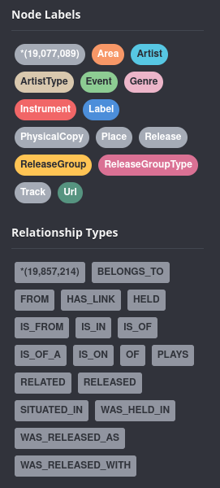
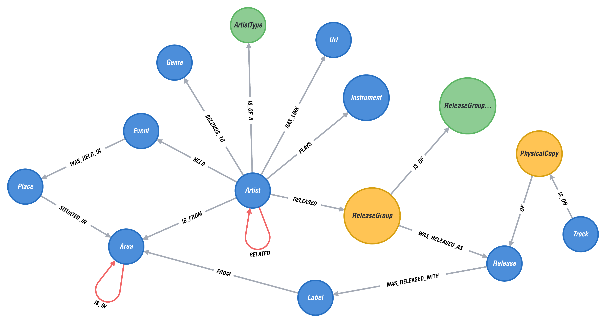

## **Description**

Music Encyclopedia - PoC.

Main application functionality is to provide answer on music related questions to user with simple way of interaction:
asking a question in natural language (English). In order to translate question from natural to query language,
application is using a sequence to sequence model - translating English question to Cypher query language. Application offers CLI interaction with option of typing in the question or using audio input (microphone is required) to ask a question (speech to text translation used - [SpeechRecognition](https://pypi.org/project/SpeechRecognition/)).

## **Tech stack** 


 

<br/>
<br/>

## **Application components**

System is comprised of graph database, querying application and seq2seq model.

<span style="font-size:larger;">**Querying application**</span> is CLI app that uses trained model, translates english question to cypher query language and returns response from database.

<span style="font-size:larger;">**Sequence to sequence model**</span> - Language translation is complex problem to solve. When translating a sentence from one language to another, the translation is influenced by various factors. In addition to syntax, linguistic, phonological, lexical factors, the context is often very important and translation depends on both cultural and personal factors. When translating the sentence **"What is your phone number?"** from English language that has five words (21 character), to Chinese language **"你的电话号码是多少?"** where the sentence has six words (nine characters), is clearly visible that it is not possible to perform a translation simply by translating sentences word by word. This problem can be overcome with the help of the sequence to sequence model, which is characterized by the possibility of translation sentences (sequences), or input vector X into output vector Y that are not of the same length.

**English to Cypher translation example:**<br/>
**[English]** Where is < NameOfArtist > from?<br/>
**[Cypher]** MATCH (var1: Artist{Name: "< NameOfArtist >"})-[:IS_FROM]-(var2: Area) RETURN var2<br/>

This model is based on tensorflow seq2seq model for more info. visit:

- https://www.tensorflow.org/text/tutorials/text_generation
- https://www.tensorflow.org/text/guide/tf_text_intro
- https://www.tensorflow.org/addons/tutorials/networks_seq2seq_nmt
> **Warning**:
> For model training and changes: **GPU** acceleration is highly recommended, visit [install link](https://www.tensorflow.org/install) for more info.

<span style="font-size:larger;">**Graph database**</span> is using data from [Musicbrainz database](https://musicbrainz.org/), aquired from local copy with ETL process and transformed from RDB PostgreSQL to Neo4j graph database. There is 19,077,089 Nodes and 19,857,214 Relationships between them.

**Database stats and metagraph:**




## **Deployment**

Running database as docker container and running application with local python installation.

**Requirements:**
  - database: installed docker, ~6GB of free space 
  - application: installed python v 3.7-3.10, LOW space requirement, (microphone is required only for voice search option)

### **Database:**

  Execute deploy.sh(on linux) or execute next four commands:
  
  run neo4j docker container
  ```
  docker run -d --name=mbdb --publish=7474:7474 --publish=7687:7687 --env=NEO4J_ACCEPT_LICENSE_AGREEMENT=yes --env=NEO4J_AUTH=none neo4j:4.2.1-enterprise
  ```
  download database dump
  ```
  docker exec -it mbdb wget https://www.dropbox.com/s/t884p9obs72loyc/musicbrainz-backup.dump?dl=0 -O /var/lib/neo4j/import/musicbrainz-backup.dump
  ```
  load database dump
  ```
  docker exec -u neo4j -it mbdb neo4j-admin load --database=musicbrainz --from=/var/lib/neo4j/import/musicbrainz-backup.dump
  ```
  create and start database
  ```
  docker exec -u neo4j -it mbdb cypher-shell "CREATE DATABASE musicbrainz;"
  ```

  database is available on http://localhost:7474 - choose no authentication option and connect, then choose database and select musicbrainz or $:use musicbrainz

### **Application:**
  ```
  pip install -r requirements.txt
  ```
  ```
  python3 musicbrainz.py
  ```
### **Usage**
enter 'help' or '-h' to see available commands